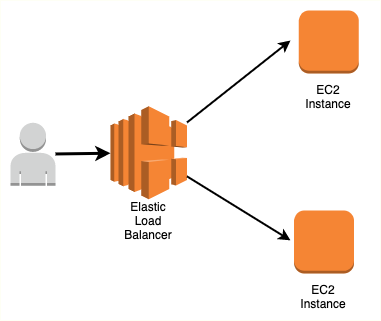

# Elasttic Load Balancer

## Diagram


##### Steps
1. create ec2
	- create ec2 instance in multiple AZ's
2. create target group
	- create subnet (private)
	- register nessary servers to target group
3. create elastic load balancer
4. add cname record to domain


##### ELB with Auto Scaling Group
1. Create a Application Load Balancer
   - In the wizard, also create Target group but do not add any 
     instances
2. Create an Autoscaling Group
   - Minimum size 2, Max 4, Desired 2
3. Create Launch Configuration. 
   - Make sure you add userdata to download and install website
   - Associate Target group with Autoscaling group
   - Associate ELB health check
   - Set autoscaling policy on Average CPU greater than 20%.  
     Configure email notification.
   - Confirm email subscription. 
4. Wait for instances to be running.
    - See if you are able to access your Web Application using Load 
       balancer DNS
    - Increase the load on web servers
    - Login to any of the EC2 over ssh (Make sure 22 port is open)
    - Install stress: sudo yum install stress -y
5. Increase system load: stress --cpu 8 --timeout 3000
6. Wait for 5 mins and see if scaling activities happen


##### Userdata
```console
	#!/bin/bash
	yum install httpd -y
	service httpd start
	chkconfig httpd on
	wget link
	unzip file.zip
	cp -r file.zip* -d /var/www/html/
```
