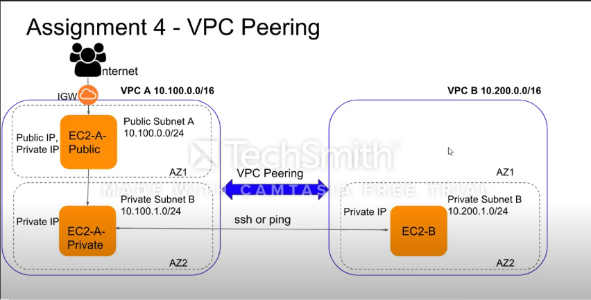

# VPC Peering

## Diagram

##### VPC 1
- create vpc
	- create subnets (private & public)
	- create internet gateway
	- create two route table (private & public)
	- associate rout tables with appropiate subnets
	- add route to igw in public subnet

- create ec2
	- create two ec2 instances in appropiate subnets
	- in private server accept trafic only from public server

##### VPC 2
- create vpc
	- create subnet (private)
	- create route table (private)
	- associate rout table with appropiate subnets

- create ec2
	- create ec2 instances in appropiate subnet
	- in private server accept trafic only from vpc 1 subnet

##### VPC Peering
- create peering connection from any vpc
	- select requester as same vpc
	- select accepter as second vpc
	- edit accepter route table in private subnet to send trafic to peering connection
	- edit requester route table in private subnet to send trafic to peering connection